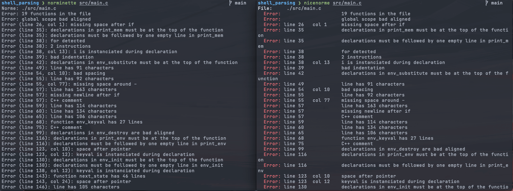

# Nicenorme

Nicenorme is a wrapper for norminette that makes it a little more pleasant to look at.



## Installation
```
	git clone https://github.com/VictorTennekes/nicenorme && sudo bash ./nicenorme/install.sh
```
By default `nicenorme` will be installed at `/usr/local/bin/nicenorm`.
To specify a custom path run the installer as follows: `sudo install.sh <PATH>`.

## Extra
To make norming your headers easy be sure to check out [Forehead](https://github.com/Tishj/forehead) by [Tishj](https://github.com/Tishj).
